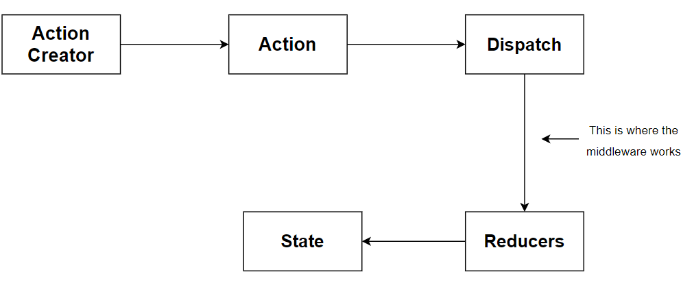
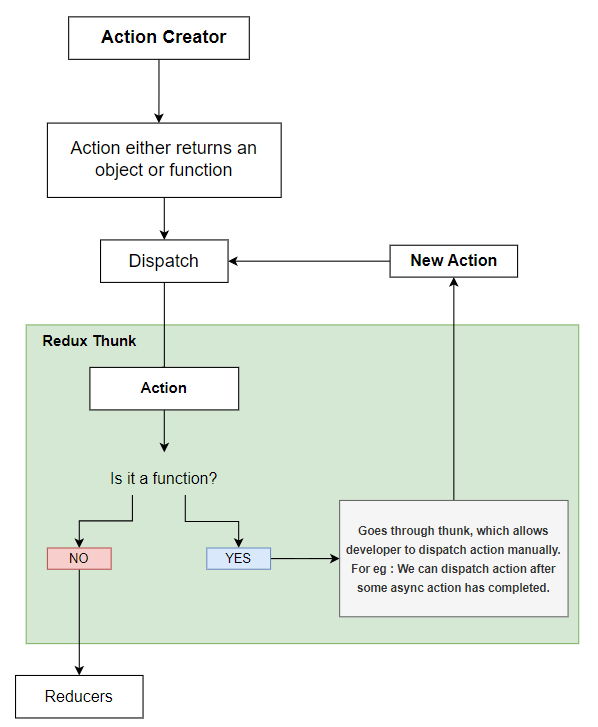

server:
1. npm init -y : install package.json
2. npm install body-parser cors express mongoose nodemon
3. npm i dotenv
4. npm i google-auth-library jsonwebtoken
5. What Is Body-parser?
6. npm install bcryptjs

- Express body-parser is an npm module used to process data sent in an HTTP request body. It provides four express middleware for parsing JSON, Text, URL-encoded, and raw data sets over an HTTP request body. Before the target controller receives an incoming request, these middleware routines handle it.
- Body parser is replace with express.json() in recent versions of express
- This should not introduce any breaking changes into your applications since the code in express.json() is based on bodyparser.json().
  ## Rest API:
  - You can think of an API as a mediator between the users or clients and the resources or web services they want to get. 
  - It’s also a way for an organization to share resources and information while maintaining security, control, and authentication—determining who gets access to what
  - REST is a set of architectural constraints, not a protocol or a standard.
  - REST stands for representational state transfer 
  - When a client request is made via a RESTful API, it transfers a representation of the state of the resource to the requester or endpoint. 
  - This information, or representation, is delivered in one of several formats via HTTP: JSON (Javascript Object Notation), HTML, XLT, Python, PHP, or plain text.
  -  SOAP (Simple Object Access Protocol), which has specific requirements like XML messaging, and built-in security and transaction compliance that make it slower and heavier. 
  
- `cors`: The CORS Policy Enables Cross-origin resource sharing (CORS) in Express Gateway. CORS defines a way in which a browser and server can interact and determine whether or not it is safe to allow a cross-origin request.
- CORS is a mechanism implemented by browsers to block requests from domains other than the server's one. When a browser makes a request, it adds an origin header to the request message. If it goes to the server of the exact origin, it is allowed by the browser, and if it does not, the browser blocks it.
  ## express.json() & express.urlencoded():
  - You NEED express.json() and express.urlencoded() for POST and PUT requests, because in both these requests you are sending data (in the form of some data object) to the server and you are asking the server to accept or store that data (object), which is enclosed in the body (i.e. req.body) of that (POST or PUT) Request
  - Express provides you with middleware to deal with the (incoming) data (object) in the body of the request.
  - `express.json()` is a method inbuilt in express to recognize the incoming Request Object as a JSON Object. This method is called as a middleware in your application using the code: app.use(express.json());
  - `express.urlencoded()` is a method inbuilt in express to recognize the incoming Request Object as strings or arrays. This method is called as a middleware in your application using the code: app.use(express.urlencoded());

# client
1. npm install axios moment react-file-base64 redux react-redux redux-thunk
2. npm install @mui/icons-material @mui/material @emotion/styled @emotion/react
3.  npm install jwt-decode
4.  npm i @react-oauth/google
5.  npm i react-router react-router-dom

## Redux-Thunk
   -  it is a middleware that looks at every action that passes through the system, and if it’s a function, it calls that function. That’s all it does.
   -  It allows us to return functions instead of objects from redux actions. Plain redux doesn’t allow complex logic inside action functions, you can only perform simple synchronous updates by dispatching action.
   -  This middleware extends its ability and lets you write complex logic that interacts with the store. Thunk doesn’t interfere with the action until it returns a function
;

## useSelector()
   - Allows you to extract data from the Redux store state for use in this component, using a selector function.
   - When an action is dispatched, useSelector() will do a reference comparison of the previous selector result value and the current result value. 
   - If they are different, the component will be forced to re-render. If they are the same, the component will not re-render.
   - When the function component renders, the provided selector function will be called and its result will be returned from the useSelector() hook

## useDispatch()
   - This hook returns a reference to the dispatch function from the Redux store. You may use it to dispatch actions as needed
## Base64
- Base64 also known as Base64 Content-Transfer-Encoding is an encoding and decoding technique used to convert binary data to an American Standard for Information Interchange (ASCII) text format, and vice versa.
- Any binary data (such as an image in this case) can be encoded by base64 and the encoded data is usually composed of 64 English characters which isn't human-readable. When an image is stored using base64 to a database such as MongoDB, the image is stored as a string in the database. This string can then be decoded back to its original form when needed.

forms --> adding data to state : postData -->handleSubmit(): dispatch(createPost(postData))--> createPost() in action : api.createPost(post) --> call api: axios.post(url):url=localhost:5000/posts -->router route to controllers:posts --> create new schema(mongodb): save the data -->send json response to client --> dispatch(data) --> reducer : return updated state --> store -->all compoents recieve updates

## moment
  - 

https://www.svgbackgrounds.com/#liquid-cheese

client id:
959818041316-5ovvcs1klpkcm8uiq895jk3uvmorblpn.apps.googleusercontent.com

client secret:
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

<!-- authentication middleware -->
<!-- once the user is logged in, he/she can create/update/delete their post.  But we have to tell teh backened to allow him to do that: we will need a middleware to do that -->